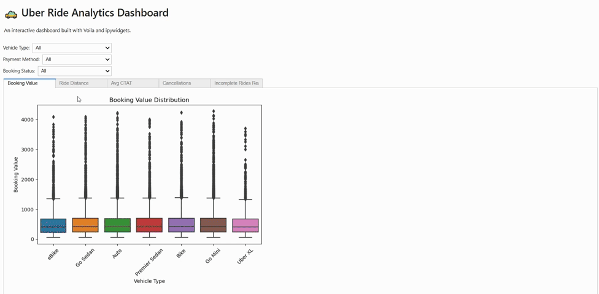
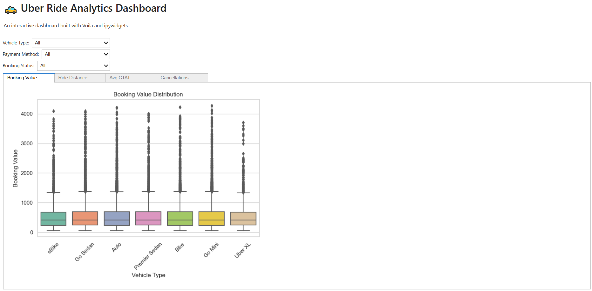
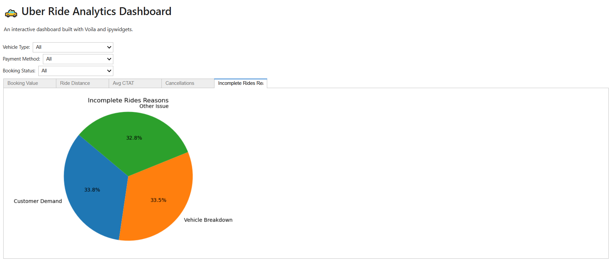

# 🚕 Uber Ride Analytics – Exploratory Data Analysis

> 🧠 A comprehensive EDA project on Uber ride data, revealing business insights, customer behaviors, and operational gaps.

This project performs an end-to-end **Exploratory Data Analysis (EDA)** on an Uber ride dataset with over 140,000 records. It includes data cleaning, univariate and bivariate visualizations, missing value treatment, outlier analysis, and actionable business insights.

We also provide an interactive analytics dashboard built with **Voila** and **ipywidgets** for real-time filtering and visualization.

---


---

## 🗂️ Table of Contents

- [📁 Dataset](#-dataset)
- [🎯 Objectives](#-objectives)
- [📊 EDA Summary](#-eda-summary)
- [📈 Key Visuals](#-key-visuals)
- [💡 Insights & Recommendations](#-insights--recommendations)
- [⚙️ Tech Stack](#-tech-stack)
- [▶️ How to Run](#-how-to-run)
- [📊 Dashboard Features](#-dashboard-features)
- [📄 License](#-license)

---

## 📁 Dataset

- 📌 **Source:** [Kaggle - Uber Ride Analytics Dashboard](https://www.kaggle.com/datasets/yashdevladdha/uber-ride-analytics-dashboard)
- 💾 **Size**: ~140,000 rows 
- 📚 **Features:** Booking ID, Status, Payment Method, Distance, Ratings, etc.

---

## 📁 Repository Structure
.
├── EDA_on_Uber_dataset.ipynb # Main EDA notebook
├── uber_dashboard_voila.ipynb # Interactive dashboard version for Voila
├── ncr_ride_bookings.csv # Dataset 
└── README.md # This file

---

## 🎯 Objectives

- Handle missing data and outliers logically
- Analyze ride completion and cancellation patterns
- Understand feature correlations
- Extract actionable business insights

---

## 📊 EDA Summary

We performed comprehensive data analysis covering:

- ✅ Missing value patterns and handling (MCAR, MAR, MNAR)
- ✅ Outlier detection and treatment
- ✅ Univariate analysis of numerical and categorical features
- ✅ Bivariate analysis of key variable relationships
- ✅ Correlation matrix and heatmap for numerical features
- 
---

## 📈 Key Visuals

### Booking Value by Vehicle Type


### Incomplete Ride Reasons


---

## 💡 Insights & Recommendations

- ✅ Most rides complete successfully, but incomplete/canceled rides expose operational gaps.
- 🤧 Health-related cancellations are frequent — consider adding pre-screening for riders.
- 📍 "Customer not found" is a top failure reason — improve GPS accuracy and pickup instructions.
- 💳 Digital payments are common in high-value rides — promote them among all user segments.

---

## ⚙️ Tech Stack

- Python (Pandas, Matplotlib, Seaborn)
- Jupyter Notebook
- Missingno
- Markdown & Git

---

## ▶️ How to Run

1. Clone this repository
2. Install the required packages
3. Run `EDA_on_Uber_dataset.ipynb` in Jupyter

---

## 📊 Dashboard Features

The interactive dashboard (`uber_dashboard_voila.ipynb`) is built with **Voila** and **ipywidgets**, enabling real-time filtering and visual exploration of Uber ride data.

### 🎛️ Available Filters

- **Vehicle Type** – e.g., Sedan, SUV, Mini (with “All” option)
- **Payment Method** – e.g., Cash, UPI, Card
- **Booking Status** – e.g., Completed, Cancelled by Customer, Cancelled by Driver

These filters work **independently or in combination**, allowing dynamic data slicing.

---

### 📈 Visualizations by Tab

| Tab                        | Description                                                                 |
|---------------------------|-----------------------------------------------------------------------------|
| **Booking Value**         | 📦 Boxplot of `Booking Value` grouped by `Vehicle Type`                     |
| **Ride Distance**         | 🚗 Histogram showing the distribution of ride distances                     |
| **Avg CTAT**              | ⏱️ Violin plot of `Average Customer Trip Acceptance Time` by vehicle type  |
| **Cancellations**         | ❌ Count plot of rides cancelled by the customer                            |
| **Incomplete Rides Reason** | 📉 Pie chart of the reasons why rides were marked incomplete               |

Each plot responds immediately to selected filter values, giving a seamless exploratory experience.

---

### ✅ Highlights

- Clean tabbed layout using `ipywidgets.Tab`
- Graceful handling of missing data
- Supports filtering large datasets with over 140,000 rows
- Suitable for both EDA and operational insight presentation

> **Run it with:**  
> ```bash
> voila uber_dashboard_voila.ipynb
> ```

This will open a browser window at ```http://localhost:8866``` with an interactive dashboard.

> Make sure to install required packages:  
> ```bash
> pip install voila ipywidgets pandas matplotlib seaborn
> ```

---

## 📄 License

This project is licensed under the MIT License.

