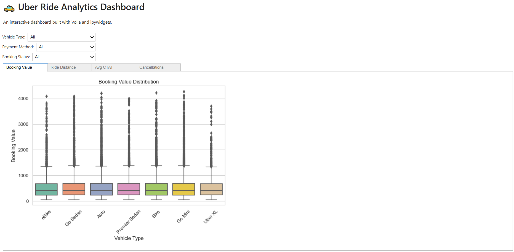

# 🚕 Uber Ride Analytics – Exploratory Data Analysis

> 🧠 A comprehensive EDA project on Uber ride data, revealing business insights, customer behaviors, and operational gaps.

---

## 🗂️ Table of Contents

- [📁 Dataset](#dataset)
- [🎯 Objectives](#objectives)
- [📊 EDA Summary](#eda-summary)
- [📈 Key Visuals](#key-visuals)
- [💡 Insights & Recommendations](#insights--recommendations)
- [⚙️ Tech Stack](#tech-stack)
- [▶️ How to Run](#how-to-run)
- [📄 License](#license)

---

## 📁 Dataset

- 📌 **Source:** [Kaggle - Uber Ride Analytics Dashboard](https://www.kaggle.com/datasets/yashdevladdha/uber-ride-analytics-dashboard)
- 💾 **Rows:** 140,000+  
- 📚 **Features:** Booking ID, Status, Payment Method, Distance, Ratings, etc.

---

## 🎯 Objectives

- Handle missing data and outliers logically
- Analyze ride completion and cancellation patterns
- Understand feature correlations
- Extract actionable business insights

---

## 📈 Key Visuals

### Booking Value by Vehicle Type

### Incomplete Ride Reasons

---

## 💡 Insights & Recommendations

- ✅ Most rides complete successfully, but incomplete/canceled rides expose operational gaps.
- 🤧 Health-related cancellations are frequent — consider adding pre-screening for riders.
- 📍 "Customer not found" is a top failure reason — improve GPS accuracy and pickup instructions.
- 💳 Digital payments are common in high-value rides — promote them among all user segments.

---

## ⚙️ Tech Stack

- Python (Pandas, Matplotlib, Seaborn)
- Jupyter Notebook
- Missingno
- Markdown & Git

---

## ▶️ How to Run

1. Clone this repository
2. Install the required packages
3. Run `EDA_on_Uber_dataset.ipynb` in Jupyter

---

## 📄 License

This project is licensed under the MIT License.

